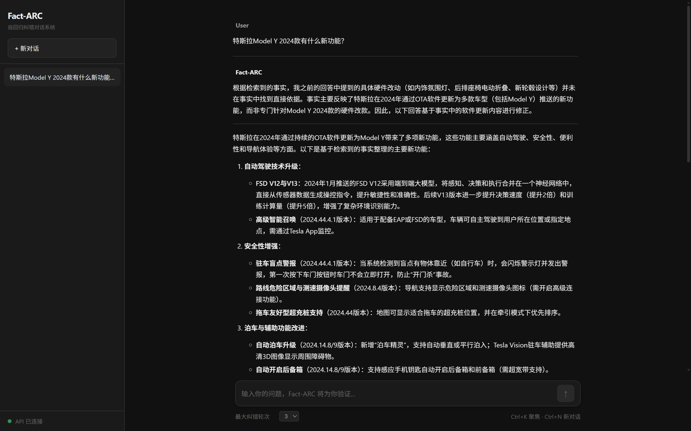

# Fact-ARC

Fact-based Auto-Regressive Correction —— 基于事实比对的自回归纠错系统

一个集成了“生成-检索-比对-纠错”闭环架构的智能对话系统。每个回答都经过外部事实检索和独立模型验证，确保输出准确可靠。

## 核心特性

- 自回归纠错循环 —— 模型生成回答后，自动检索外部事实并与独立核查模型比对，不一致时触发纠错重生成，循环至达到置信度阈值

- 智能关键词提取 —— 基于 jieba 分词 + 词性标注自动提取核心关键词，优化检索精度

- Bocha API 联网检索 —— 调用 Bocha 搜索引擎实时获取最新事实信息，突破模型知识截止限制

- 双模型体系 —— 主模型负责生成，核查模型独立验证，分离关注点提升可靠性

- 灵活配置 —— 支持主模型和核查模型使用不同的 API 端点/密钥/模型，兼容 OpenAI 格式

- 现代化 WebUI —— 简洁深色主题界面，支持 Markdown 渲染、验证轨迹可视化、多轮对话历史

- FastAPI 生产级 API —— 提供 /v1/chat/completions 标准接口，完整的错误处理和异常降级

- 配置持久化 —— 首次配置后可保存至本地加密文件，下次启动一键复用

核心循环流程：

1. 生成 —— 主模型根据用户查询生成初始回答

2. 检索 —— 自动提取关键词，调用 Bocha API 搜索外部事实

3. 比对 —— 独立核查模型判断回答与事实的一致性，输出置信度 (0-100)

4. 纠错 —— 置信度低于阈值时，将事实上下文反馈给主模型重新生成

5. 循环 —— 重复步骤 2-4，直至达到置信度阈值或最大循环次数

## 快速开始

环境要求

- Python 3.10+

- 主模型 API（兼容 OpenAI 格式）

- 核查模型 API（兼容 OpenAI 格式，可与主模型相同）

- Bocha API Key（联网搜索）

安装

下载本项目压缩包并解压

# 安装依赖
pip install -r requirements.txt

启动

python main.py

首次启动将进入交互式配置向导，按提示输入：

- 主模型 base URL、API Key、模型名称

- Bocha API Key

- 核查模型 base URL、API Key、模型名称

配置完成后，服务将在 http://localhost:1010 启动。

使用

- WebUI: 浏览器打开 http://localhost:1010 直接使用

- API 文档: http://localhost:1010/docs 查看 Swagger 文档

- API 调用:

curl -X POST http://localhost:1010/v1/chat/completions \
  -H "Content-Type: application/json" \
  -d '{
    "query": "2024年诺贝尔物理学奖得主是谁？",
    "max_loops": 3
  }'

## 项目结构

Fact-ARC/
├── main.py              # FastAPI 应用入口、CLI 启动、关键词提取
├── config.py            # 配置管理、交互式收集、模型列表获取
├── loop.py              # 核心纠错循环引擎（生成-检索-比对-纠错）
├── models.py            # Pydantic 数据模型定义
├── retriever.py         # Bocha API 检索器
├── verifier.py          # 核查模型比对模块（含完整降级逻辑）
├── WebUI.html           # 前端单页面应用
├── requirements.txt     # Python 依赖
└── README.md

## API 接口

POST /v1/chat/completions

请求体：

{
  "query": "你的问题",
  "max_loops": 3
}

参数说明：

| 参数         | 类型    | 必填 | 说明                           |
|-------------|---------|------|--------------------------------|
| query       | string  | 是   | 用户查询问题                   |
| max_loops   | integer | 否   | 最大纠错循环次数，默认使用服务端配置 |

响应体：

{
  "final_answer": "经过验证的最终回答",
  "correction_loop_count": 2,
  "verification_trail": [
    {
      "round": 1,
      "answer": "初始回答",
      "retrieved_facts": [...],
      "verify_response": {
        "consistent": false,
        "confidence": 65,
        "reason": "部分事实与参考资料不符..."
      }
    }
  ]
}

GET /health

健康检查接口，返回服务状态。

## 配置说明

| 配置项                  | 说明                         | 默认值                       |
|------------------------|------------------------------|------------------------------|
| max_loops              | 最大纠错循环次数             | 3                            |
| confidence_threshold   | 置信度阈值 (0-100)           | 90                           |
| main_base_url          | 主模型 API 端点              | https://api.openai.com/v1    |
| verifier_base_url      | 核查模型 API 端点            | https://api.openai.com/v1    |

配置文件保存于 ~/.factarc_config.json，API 密钥经过 Base64 编码存储。

## 核查提示词

核查模型使用精心设计的内置提示词，包含：

- 分层置信度标准 —— 一致(≥90)、模糊一致(70-89)、不确定(50-69)、不一致(<50)

- 五条特殊规则 —— 矛盾一票否决、区分陈述与推测、缺失≠错误等

- 强制 JSON 输出 —— 结构化返回 consistent、confidence、reason

- 多层降级解析 —— 当模型输出非标准格式时，依次尝试正则提取、启发式分析等兜底策略

## 开源协议

本项目采用 MIT 协议开源。详见 LICENSE 文件。

## 鸣谢

- Bocha AI —— 提供强大的联网搜索 API

- jieba —— 优秀的中文分词工具

- FastAPI —— 现代化的 Python Web 框架